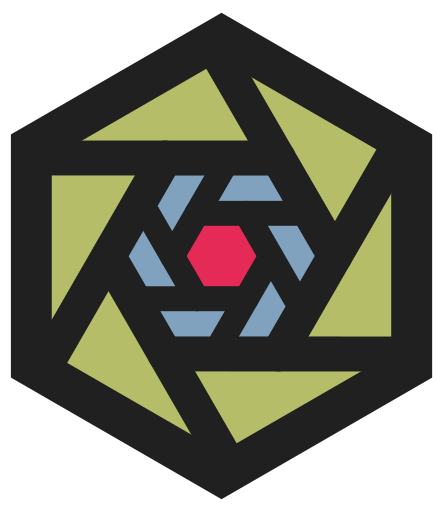
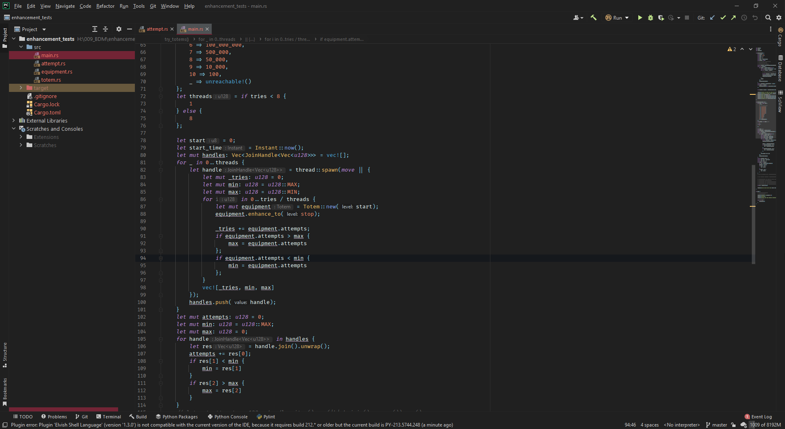
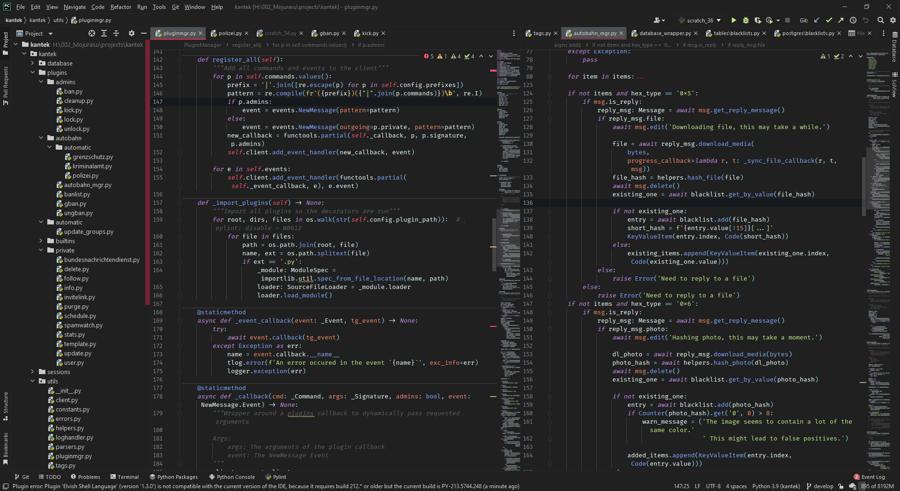

  

# kuro

<!-- Plugin description -->
Simple opinionated dark theme with a custom editor scheme.
- Accent Color is Fuchsia because of personal preference.
- Colors are taken from material or the tomorrow Night scheme
- Default Font is Fira Code

There might be some unthemed parts that default to Darcula feel free to report them as issues on the [GitHub repository](https://github.com/mojurasu/kuro)
<!-- Plugin description end -->

## Screenshots

---
Plugin based on the [IntelliJ Platform Plugin Template][template].

[template]: https://github.com/JetBrains/intellij-platform-plugin-template
